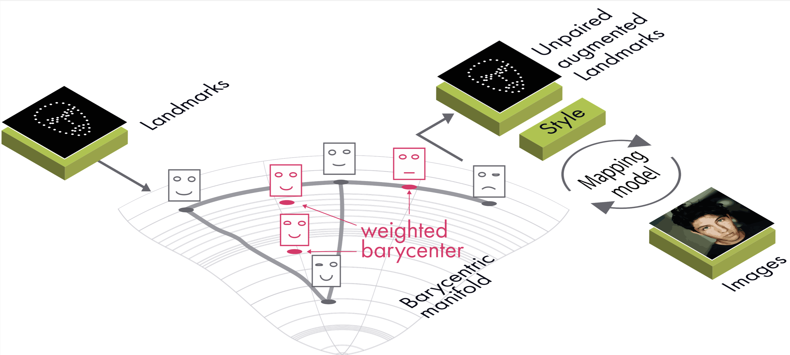

# LAMBO

Implementation of Landmarks Augmentation with Manifold-Barycentric Oversampling

## Main requirements

* PyTorch 1.5.0
* CUDA 10.0+
* GPU 16Gb

## Principal diagram of the model

## Usage

**Download datasets:**
300-W (https://ibug.doc.ic.ac.uk/resources/300-W),
Extract them into some `<data_folder>`.

Set the required paths in the config file `./src/parameters/path.json`

- data - path to the dataset.
- tensorboard - path to tensorboard logs folder.
- models - where output model will be saved.

Install python requirements:

> pip3 install -r requirements.txt

Start tensorboard:

> tensorboard --logdir=<logs_dir>

- runs (path of tensorboard in path.json)

**Generate barycenters of landmarks** on 300-W:

> cd examples

> python3 barycenter_save.py

**Train LAMBO model** on 300-W:

> cd examples

> python3 hm2img.py

**Train LAMBO model with augmentation** on 300-W:

> cd examples

> python3 hm2img_augment.py

## Project structure

- `gans` library with GAN models and utils for min-max optimization
- `./src/examples` train and test scripts
- `./src/loss` regularizers and the ther loss components
- `./src/metrics` metrics for landmarks (IOD)
- `./src/models` classes for optimal transport computation and the encoder model
- `./src/parameters` loss coefficients for GAN and encoder training
- `./src/barycenters` different types of barycenter's graph calculation
